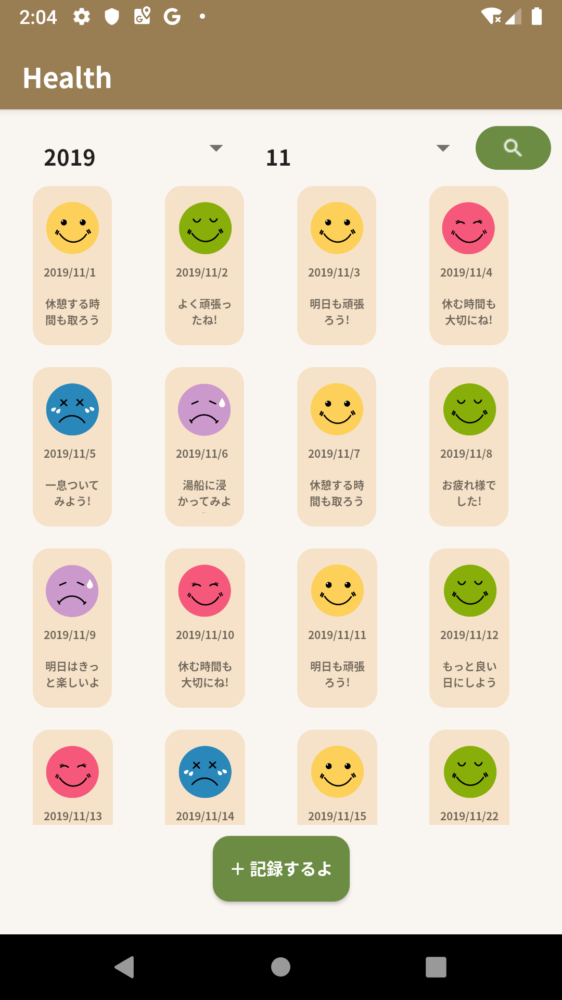
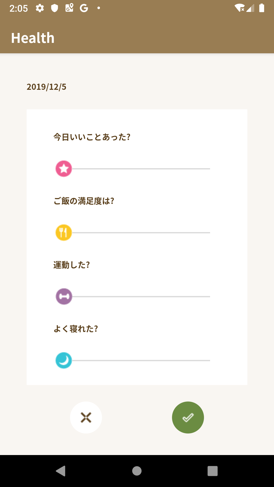

# KibunChan

気分を記録するAndroidアプリ

Google Play Storeに公開中 : [KibunChan](https://play.google.com/store/apps/details?id=com.a_rin.health)

## Description

Leaders+最終課題　: Kotlinを使用したオリジナルアプリの作成

KibunChan

  

毎日の気分をタイプすることなく記録できるアプリ。  
4つの質問に答えるだけで、今日の気分を記録し、明日へのメッセージを受け取ることができます。  
10代から30代の忙しいけれど、毎日日記をつけたい、健康にも気をつけている人向けに作成しました。  
1日の終わりに開きたくなるような、癒しを意識し、心落ち着くような緑色と茶色がベースのデザインにしました。  
